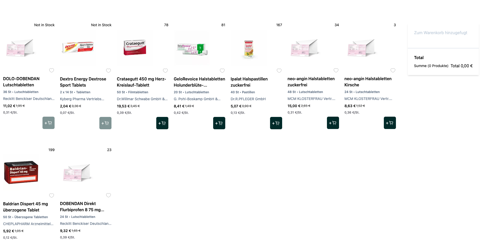

# Doc-morris


# Table of Contents

- [Getting Started](#getting-started)
- [Technology Stack](#technology-stack)
- [Installation](#installation)
- [Testing](#testing)
- [Questions](#questions)
- [Support or Contribution](#support-or-contribution)
- [Status](#status)

## Getting Started
This is a Next JS application built [Next JS](https://nextjs.org/) application. The data exists on endpoints serve through a products.json file. It provides the capabilities of displaying various products



## Technology Stack

1. Next JS
2. TypeScript


## Installation

1. Install [**Node JS**](https://nodejs.org/en/).

2. Clone the [**repository here**](https://github.com/benfluleck/doc-morris.git)
3. [**cd**] into the root of the **project directory**.
4. Run `pnpm install` on the terminal to install project dependecies

5. Start the application:

**_Build Environments_**

### For Client
**Development**
```
- pnpm dev

- Navigate to `http://localhost:3000`

```

## Testing

Client side tests - Run `pnpm test` on the terminal while within the **project root directory**.

Client side testing is achieved through the use of `jest` package and `React testing library`. `jest` is used to test javascript code in ReactReact applications. The React Testing Library is a very light-weight solution for testing React components


## Questions
For more details contact @benfluleck

## Support or Contribution
For any suggestions or contributions or issues please do raise them or email me.
For **Contributiions**, Please clone the repo and implement a PR I would appreciate it

## Status
Still undergoing testing
